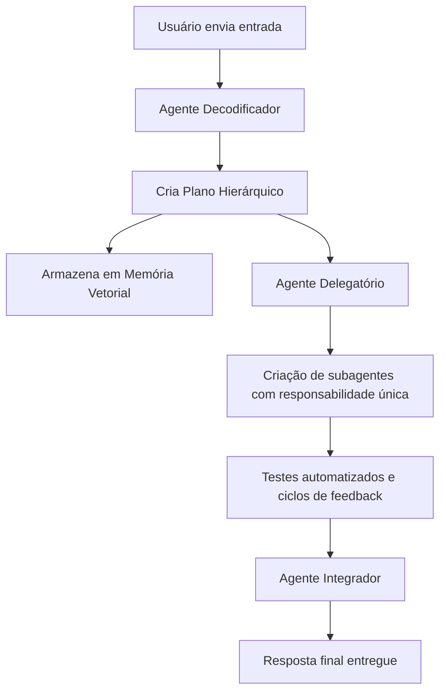

## 🚀 Agente Smith: Otimizando o Desenvolvimento de Software com TDD e IA

O **Agente Smith** é uma plataforma projetada para **agilizar e qualificar a criação de novas funcionalidades (features)**, utilizando a disciplina do **Test-Driven Development (TDD)** e a capacidade da Inteligência Artificial. Nosso objetivo é fornecer uma abordagem estruturada e assistida para o desenvolvimento, garantindo que suas features sejam construídas com solidez desde o início.

-----

### Por Que Utilizar o Agente Smith?

O Agente Smith atua como um **facilitador inteligente** no seu processo de desenvolvimento, ajudando a:

  * **Acelerar a Entrega de Features:** Ao estruturar a criação de funcionalidades em módulos e submódulos, o sistema ajuda a manter o foco e a progressão, otimizando o tempo de desenvolvimento.
  * **Garantir Qualidade com Testes:** A metodologia TDD é central. O sistema auxilia na escrita de testes antes da codificação, o que contribui para a identificação precoce de problemas e a construção de um código mais robusto.
  * **Estruturar o Ciclo de Desenvolvimento:** Ele orquestra um fluxo de trabalho contínuo de criação de testes, implementação de código e validação, seguindo o ciclo "vermelho-verde-refatorar" de forma guiada.
  * **Reduzir Retrabalho:** A validação constante através de testes ajuda a minimizar a ocorrência de bugs e a necessidade de correções posteriores, resultando em um código mais estável.

**Com o Agente Smith, você ganha um aliado para construir software de forma mais organizada, testada e eficiente, permitindo que sua equipe se concentre nos desafios de design e inovação.**

-----

### 🎯 Como Funciona: Metodologia e Fluxo

Nosso sistema de agentes é estruturado para guiar o processo de desenvolvimento, garantindo que cada etapa contribua para uma solução final validada.

1.  **Entendimento da Solicitação:** O sistema interpreta a descrição da funcionalidade desejada, transformando-a em um conjunto de requisitos claros.
2.  **Planejamento Modular:** A feature é decomposta em um plano hierárquico de módulos e submódulos, facilitando o desenvolvimento incremental. Este plano é mantido em memória para referência contínua.
3.  **Delegação Estruturada:** As responsabilidades são divididas e delegadas a agentes especializados, que atuam em tarefas específicas (como a escrita de testes ou a geração de código).
4.  **Ciclo TDD Guiado:** Para cada módulo, o sistema conduz o rigoroso ciclo TDD:
      * Um teste é criado e falha (vermelho 🔴), indicando a necessidade de implementação.
      * O código é desenvolvido para fazer o teste passar (verde 🟢).
      * O código pode ser refatorado (amarelo 🟡) para otimização, mantendo os testes passando.
      * Este ciclo se repete até que o módulo esteja completo e todos os seus testes passem.
      * 
5.  **Validação e Integração:** Após a conclusão e validação de cada módulo, o sistema auxilia na integração das partes, culminando na entrega da solução final.

<!-- end list -->



-----

### 🛠️ Tecnologias Utilizadas

Construído com ferramentas modernas e flexíveis para garantir um sistema robusto e adaptável:

  * **Orquestração de Agentes:** [LangGraph](https://github.com/langchain-ai/langgraph)
  * **Framework de LLM:** [LangChain](https://github.com/langchain-ai/langchain)
  * **Gerenciamento de Dependências:** [Poetry](https://python-poetry.org/)
  * **Linguagem de Programação:** [Python 3.11+](https://www.python.org/)
  * **Memória de Contexto (Opcional):** Bases de Dados Vetoriais (e.g., FAISS, ChromaDB, Weaviate)

-----

### 🚀 Comece a Explorar o Agente Smith

**Preparando o Projeto:**

```bash
git clone https://github.com/natanrelva/llm_agent_smith
cd llm-agent-smith
poetry install
poetry env use python3.11
source $(poetry env info --path)/bin/activate
```

**Executando os Testes:**

```bash
poetry run pytest
```