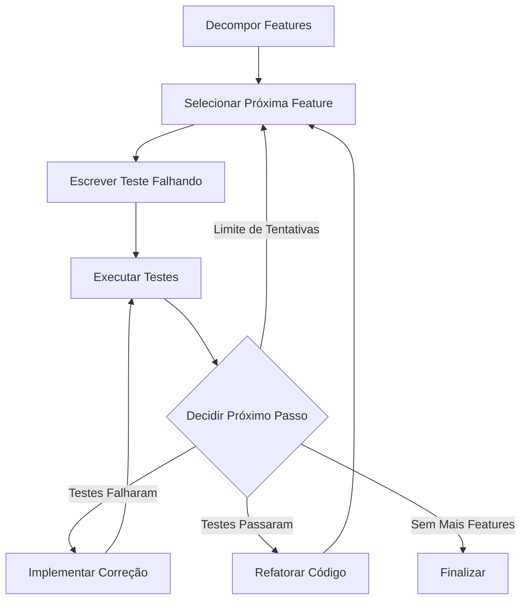

Aqui está a implementação completa usando LangGraph e o modelo Gemini para criar um sistema TDD interativo onde o usuário pode especificar o que construir:

```python
import os
import re
import ast
import json
import tempfile
import subprocess
from datetime import datetime
from pathlib import Path
from typing import Dict, List, TypedDict, Optional, Annotated
from langgraph.graph import StateGraph, END
from langchain_core.prompts import ChatPromptTemplate
from config.main import AppConfig  # Supondo que este arquivo existe com as configurações

# Importação do modelo Gemini
from langchain_google_genai import ChatGoogleGenerativeAI

class GeminiModel:
    @staticmethod
    def llm_model():
        return ChatGoogleGenerativeAI(model=AppConfig.DEFAULT_LLM_MODEL)

# Definição do estado do sistema
class TDDState(TypedDict):
    user_request: str
    features: Annotated[List[str], lambda l1, l2: l1 + l2]
    current_feature: Optional[str]
    production_code: str
    test_code: str
    test_results: Optional[str]
    history: Annotated[List[Dict], lambda l1, l2: l1 + l2]
    iteration_count: int

# Configurações
MAX_ITERATIONS = 5
MAX_FEATURE_ATTEMPTS = 3

# Funções utilitárias
def extract_code(text: str) -> str:
    """Extrai código de blocos markdown"""
    if "```python" in text:
        match = re.search(r'```python(.*?)```', text, re.DOTALL)
        if match:
            return match.group(1).strip()
    return text.strip()

def validate_interface(old_code: str, new_code: str) -> bool:
    """Verifica se a interface pública foi mantida"""
    if not old_code.strip():
        return True
        
    try:
        old_tree = ast.parse(old_code)
        new_tree = ast.parse(new_code)
        
        old_public = [n.name for n in old_tree.body 
                     if isinstance(n, (ast.FunctionDef, ast.ClassDef)) 
                     and not n.name.startswith('_')]
        
        new_public = [n.name for n in new_tree.body 
                     if isinstance(n, (ast.FunctionDef, ast.ClassDef)) 
                     and not n.name.startswith('_')]
        
        return set(old_public) == set(new_public)
    except:
        return False

def is_code_safe(code: str) -> bool:
    """Verifica se o código não contém operações perigosas"""
    dangerous_patterns = [
        r"__import__\s*\(",
        r"subprocess\.",
        r"os\.system\(",
        r"eval\(",
        r"exec\(",
        r"open\(",
        r"shutil\.",
        r"sys\.exit"
    ]
    return not any(re.search(pattern, code) for pattern in dangerous_patterns)

def run_tests(production_code: str, test_code: str) -> str:
    """Executa os testes e retorna os resultados"""
    if not test_code.strip():
        return "Nenhum teste definido"
        
    with tempfile.TemporaryDirectory() as tmpdir:
        # Salvar código de produção
        prod_path = Path(tmpdir) / "production.py"
        prod_path.write_text(production_code)
        
        # Adicionar imports necessários
        test_content = "import re\nimport sys\nsys.path.insert(0, '.')\nfrom production import *\n\n" + test_code
        
        # Salvar testes
        test_path = Path(tmpdir) / "test_production.py"
        test_path.write_text(test_content)
        
        try:
            result = subprocess.run(
                ["pytest", "-v", str(test_path)],
                capture_output=True,
                text=True,
                timeout=10
            )
            output = result.stdout + result.stderr
        except subprocess.TimeoutExpired:
            output = "ERRO: Timeout ao executar testes"
        except Exception as e:
            output = f"ERRO: {str(e)}"
        
        return output

def tests_passed(test_output: str) -> bool:
    """Verifica se todos os testes passaram"""
    return "failed" not in test_output.lower() and "error" not in test_output.lower()

# Inicialização do LLM
llm = GeminiModel.llm_model()

# Definindo os nós do workflow
def decompose_features(state: TDDState) -> TDDState:
    """Decompõe a solicitação em features mínimas testáveis"""
    prompt = ChatPromptTemplate.from_template(
        "Solicitação do usuário: {request}\n\n"
        "Decomponha em features mínimas testáveis (MFVs):\n"
        "- Uma por linha\n"
        "- Ordenadas por dependência\n"
        "- Formato JSON array\n\n"
        "Apenas a lista em formato JSON:"
    )
    
    chain = prompt | llm
    response = chain.invoke({"request": state["user_request"]})
    
    try:
        features = json.loads(response.content)
        print(f"📋 Features identificadas: {len(features)}")
        for i, feat in enumerate(features, 1):
            print(f"  {i}. {feat}")
    except json.JSONDecodeError:
        features = [state["user_request"]]
        print("⚠️ Não foi possível decompor, usando solicitação completa")
    
    history_entry = {
        "timestamp": datetime.now().isoformat(),
        "action": "Decomposição de features",
        "details": response.content[:500] + "..." if len(response.content) > 500 else response.content
    }
    
    return {
        **state,
        "features": features,
        "history": state["history"] + [history_entry]
    }

def select_next_feature(state: TDDState) -> TDDState:
    """Seleciona a próxima feature a ser implementada"""
    if not state["features"]:
        return {**state, "current_feature": None}
    
    next_feature = state["features"].pop(0)
    print(f"\n➡️ Feature atual: {next_feature}")
    
    history_entry = {
        "timestamp": datetime.now().isoformat(),
        "action": "Selecionar feature",
        "details": next_feature
    }
    
    return {
        **state,
        "current_feature": next_feature,
        "iteration_count": 0,
        "history": state["history"] + [history_entry]
    }

def write_failing_test(state: TDDState) -> TDDState:
    """Escreve um teste falhando para a feature atual"""
    prompt = ChatPromptTemplate.from_template(
        "Escreva um teste Pytest FALHANDO para a feature:\n{feature}\n\n"
        "Contexto:\nCódigo atual:\n{code}\n\n"
        "Diretrizes:\n- Teste apenas o essencial\n- Espere falhar inicialmente\n"
        "Código do teste:"
    )
    
    chain = prompt | llm
    response = chain.invoke({
        "feature": state["current_feature"],
        "code": state["production_code"]
    })
    
    new_test = extract_code(response.content)
    updated_test_code = state["test_code"] + "\n\n" + new_test
    
    history_entry = {
        "timestamp": datetime.now().isoformat(),
        "action": "Escrever teste (Fase RED)",
        "details": new_test[:500] + "..." if len(new_test) > 500 else new_test
    }
    
    print(f"📝 Teste escrito (Fase RED):\n{new_test[:200]}{'...' if len(new_test) > 200 else ''}")
    
    return {
        **state,
        "test_code": updated_test_code,
        "history": state["history"] + [history_entry],
        "iteration_count": state["iteration_count"] + 1
    }

def execute_tests(state: TDDState) -> TDDState:
    """Executa os testes e armazena os resultados"""
    test_results = run_tests(state["production_code"], state["test_code"])
    
    history_entry = {
        "timestamp": datetime.now().isoformat(),
        "action": "Executar testes",
        "details": test_results[:500] + "..." if len(test_results) > 500 else test_results
    }
    
    print(f"🧪 Resultado dos testes:\n{test_results[:300]}{'...' if len(test_results) > 300 else ''}")
    
    return {
        **state,
        "test_results": test_results,
        "history": state["history"] + [history_entry]
    }

def implement_minimal_fix(state: TDDState) -> TDDState:
    """Implementa a correção mínima para passar nos testes"""
    prompt = ChatPromptTemplate.from_template(
        "Feature: {feature}\n"
        "Código atual:\n{current_code}\n\n"
        "Testes falhando:\n{test_results}\n\n"
        "Implemente a CORREÇÃO MÍNIMA para fazer os testes passarem:\n"
        "- Alterações mínimas necessárias\n"
        "- Mantenha KISS e DRY\n"
        "- Não adicione funcionalidades extras\n\n"
        "Código corrigido:"
    )
    
    chain = prompt | llm
    response = chain.invoke({
        "feature": state["current_feature"],
        "current_code": state["production_code"],
        "test_results": state["test_results"][:1000]
    })
    
    new_code = extract_code(response.content)
    
    # Validar segurança e interface
    if not is_code_safe(new_code):
        print("⛔ Correção rejeitada: Problemas de segurança detectados!")
        return state
        
    if not validate_interface(state["production_code"], new_code):
        print("⚠️ Correção rejeitada: Interface pública alterada!")
        return state
    
    history_entry = {
        "timestamp": datetime.now().isoformat(),
        "action": "Implementar correção (Fase GREEN)",
        "details": new_code[:500] + "..." if len(new_code) > 500 else new_code
    }
    
    print(f"🔧 Código atualizado (Fase GREEN):\n{new_code[:200]}{'...' if len(new_code) > 200 else ''}")
    
    return {
        **state,
        "production_code": new_code,
        "history": state["history"] + [history_entry],
        "iteration_count": state["iteration_count"] + 1
    }

def refactor_code(state: TDDState) -> TDDState:
    """Refatora o código mantendo os testes passando"""
    prompt = ChatPromptTemplate.from_template(
        "Refatore o código mantendo o mesmo comportamento:\n"
        "Código atual:\n{code}\n\n"
        "Diretrizes:\n"
        "1. Aplique KISS e DRY\n"
        "2. Melhore legibilidade\n"
        "3. Não altere funcionalidades\n"
        "Código refatorado:"
    )
    
    chain = prompt | llm
    response = chain.invoke({"code": state["production_code"]})
    
    new_code = extract_code(response.content)
    
    # Validar segurança e interface
    if not is_code_safe(new_code):
        print("⛔ Refatoração rejeitada: Problemas de segurança!")
        return state
        
    if not validate_interface(state["production_code"], new_code):
        print("⚠️ Refatoração rejeitada: Interface pública alterada!")
        return state
    
    history_entry = {
        "timestamp": datetime.now().isoformat(),
        "action": "Refatorar código (Fase REFACTOR)",
        "details": new_code[:500] + "..." if len(new_code) > 500 else new_code
    }
    
    print(f"✨ Código refatorado (Fase REFACTOR):\n{new_code[:200]}{'...' if len(new_code) > 200 else ''}")
    
    return {
        **state,
        "production_code": new_code,
        "history": state["history"] + [history_entry]
    }

def should_continue(state: TDDState) -> str:
    """Decide o próximo passo baseado no estado atual"""
    # Se não há mais features, terminar
    if not state["current_feature"]:
        return "END"
    
    # Se testes passaram, refatorar
    if tests_passed(state["test_results"]):
        return "refactor"
    
    # Se excedeu o número máximo de tentativas, passar para próxima feature
    if state["iteration_count"] >= MAX_FEATURE_ATTEMPTS:
        print("⚠️ Atenção: Feature não implementada após tentativas máximas")
        return "select_next_feature"
    
    # Caso contrário, tentar corrigir novamente
    return "implement_fix"

def finalize(state: TDDState) -> TDDState:
    """Ações finais após completar todas as features"""
    print(f"\n{'='*60}\n🏁 TDD COMPLETO!")
    print(f"📏 Código final: {len(state['production_code'].splitlines())} linhas")
    print(f"🧪 Testes: {len(state['test_code'].splitlines())} linhas")
    
    # Salvar resultados
    with open("production_code.py", "w") as f:
        f.write(state["production_code"])
    
    with open("test_production.py", "w") as f:
        f.write(state["test_code"])
    
    with open("tdd_history.json", "w") as f:
        json.dump(state["history"], f, indent=2)
    
    print("\n💾 Resultados salvos:")
    print("- production_code.py: Código de produção")
    print("- test_production.py: Testes unitários")
    print("- tdd_history.json: Histórico do ciclo TDD")
    
    return state

# Construindo o workflow com LangGraph
workflow = StateGraph(TDDState)

# Definindo os nós
workflow.add_node("decompose", decompose_features)
workflow.add_node("select_next_feature", select_next_feature)
workflow.add_node("write_test", write_failing_test)
workflow.add_node("run_tests", execute_tests)
workflow.add_node("implement_fix", implement_minimal_fix)
workflow.add_node("refactor", refactor_code)
workflow.add_node("finalize", finalize)

# Definindo o fluxo inicial
workflow.set_entry_point("decompose")
workflow.add_edge("decompose", "select_next_feature")

# Fluxo para cada feature
workflow.add_edge("select_next_feature", "write_test")
workflow.add_edge("write_test", "run_tests")
workflow.add_edge("run_tests", "decide_next_step")

# Ponto de decisão após executar testes
workflow.add_conditional_edges(
    "decide_next_step",
    should_continue,
    {
        "implement_fix": "implement_fix",
        "refactor": "refactor",
        "select_next_feature": "select_next_feature",
        "END": "finalize"
    }
)

# Fluxo após implementar correção
workflow.add_edge("implement_fix", "run_tests")

# Fluxo após refatoração
workflow.add_edge("refactor", "select_next_feature")

# Finalização
workflow.add_edge("finalize", END)

# Compilar o workflow
tdd_agent = workflow.compile()

# Interface do usuário
def main():
    print("\n" + "="*60)
    print("🚀 TDD Automatizado com Gemini e LangGraph")
    print("="*60)
    print("Descreva o que você quer construir (ex: 'Implemente um validador de CPF')")
    print("Digite 'sair' para terminar\n")
    
    while True:
        user_request = input("\n🎯 O que você quer construir? ")
        
        if user_request.lower() in ['sair', 'exit', 'quit']:
            break
        
        # Estado inicial
        initial_state = {
            "user_request": user_request,
            "features": [],
            "current_feature": None,
            "production_code": "",
            "test_code": "",
            "test_results": None,
            "history": [],
            "iteration_count": 0
        }
        
        # Executar o workflow
        print(f"\n{'='*60}\n🧪 Iniciando TDD para: {user_request}\n{'='*60}")
        result = tdd_agent.invoke(initial_state, {"recursion_limit": MAX_ITERATIONS})
        
        print("\n✅ Processo concluído! Verifique os arquivos gerados.")
    
    print("\nObrigado por usar o TDD Automatizado!")

if __name__ == "__main__":
    main()
```

## Como Funciona o Sistema

### Fluxo do Workflow TDD


### Componentes Principais:

1. **Workflow LangGraph**:
   - Gerencia o estado completo do processo TDD
   - Orquestra as transições entre fases do ciclo
   - Controla iterações e decisões condicionais

2. **Modelo Gemini**:
   - Gera código para testes (Fase RED)
   - Implementa correções (Fase GREEN)
   - Refatora o código (Fase REFACTOR)
   - Decompõe features complexas

3. **Sistema de Validação**:
   - Verificação de segurança do código gerado
   - Validação de interface pública
   - Execução real de testes com pytest

4. **Histórico Completo**:
   - Registro de todas as ações e decisões
   - Armazenamento em formato JSON
   - Rastreabilidade completa do processo

### Como Executar:

1. **Instalação de dependências**:
```bash
pip install langgraph langchain-google-genai pytest
```

2. **Configuração** (crie um arquivo config/main.py):
```python
# config/main.py
class AppConfig:
    DEFAULT_LLM_MODEL = "gemini-1.5-flash"  # Ou outro modelo suportado
    # GOOGLE_API_KEY = "sua_chave_aqui"  # Descomente se necessário
```

3. **Execução**:
```bash
python tdd_system.py
```

### Fluxo de Interação:

1. O usuário descreve o que quer construir:
   ```
   🎯 O que você quer construir? Implemente um validador de CPF que verifique formato e dígitos
   ```

2. O sistema automaticamente:
   - Decompõe em features mínimas
   - Implementa cada feature usando TDD
   - Executa testes reais em ambiente isolado
   - Refatora o código após testes passarem

3. Ao final, gera:
   - Código de produção (production_code.py)
   - Testes unitários (test_production.py)
   - Histórico completo do processo (tdd_history.json)

### Exemplo de Saída:
```
====================================================================
🧪 Iniciando TDD para: Implemente um validador de CPF...
====================================================================
📋 Features identificadas: 3
  1. Validação do formato 000.000.000-00
  2. Cálculo do primeiro dígito verificador
  3. Validação completa do CPF

➡️ Feature atual: Validação do formato 000.000.000-00
📝 Teste escrito (Fase RED):
def test_valida_formato():
    assert valida_cpf('111.111.111-11') is True
    assert valida_cpf('11111111111') is False...
🧪 Resultado dos testes:
============================= test session starts ==============================
test_production.py::test_valida_formato FAILED                            [100%]
...
🔧 Código atualizado (Fase GREEN):
def valida_cpf(cpf: str) -> bool:
    import re
    return bool(re.match(r'^\d{3}\.\d{3}\.\d{3}-\d{2}$', cpf))
...
✨ Código refatorado (Fase REFACTOR):
CPF_PATTERN = re.compile(r'^\d{3}\.\d{3}\.\d{3}-\d{2}$')
def valida_cpf(cpf: str) -> bool:
    return bool(CPF_PATTERN.match(cpf))

➡️ Feature atual: Cálculo do primeiro dígito verificador...
...
🏁 TDD COMPLETO!
📏 Código final: 25 linhas
🧪 Testes: 42 linhas

💾 Resultados salvos:
- production_code.py: Código de produção
- test_production.py: Testes unitários
- tdd_history.json: Histórico do ciclo TDD
```

## Benefícios da Implementação

1. **TDD Autêntico**:
   - Ciclo rigoroso Red-Green-Refactor
   - Feedback imediato de testes reais

2. **Segurança**:
   - Prevenção contra código perigoso
   - Validação de contratos de interface

3. **Rastreabilidade**:
   - Histórico completo de todas as decisões
   - Diffs implícitos através do histórico

4. **Extensibilidade**:
   - Facilmente adaptável para novos tipos de teste
   - Pode ser integrado com outros modelos LLM